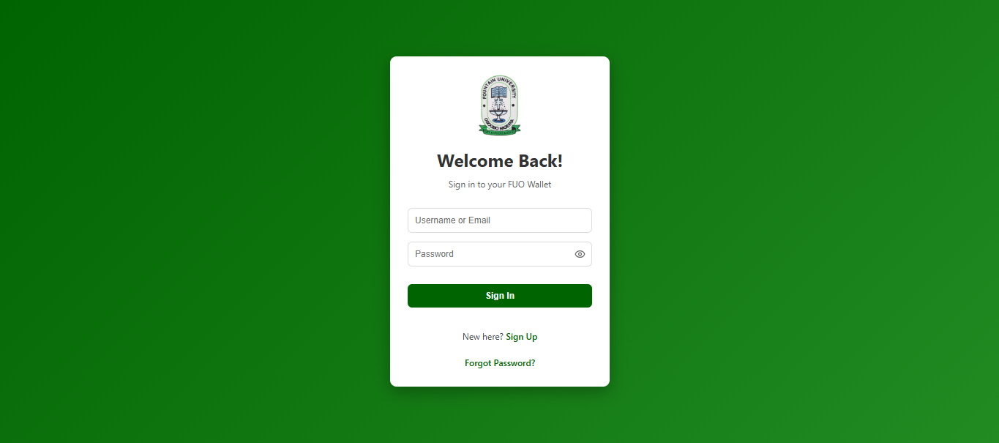
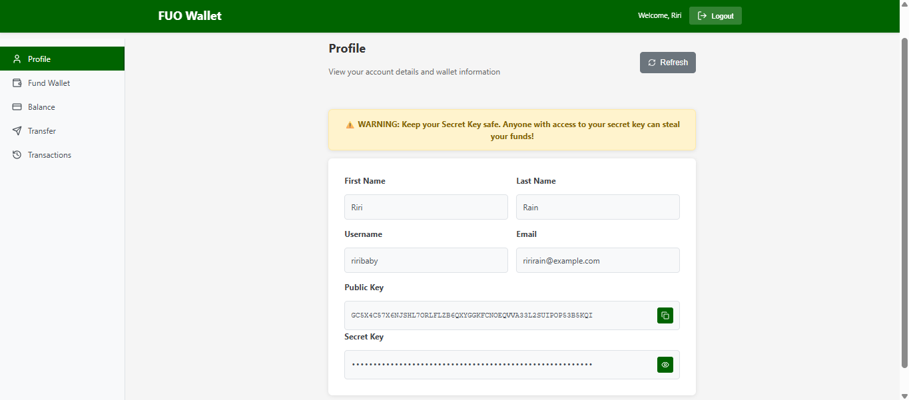
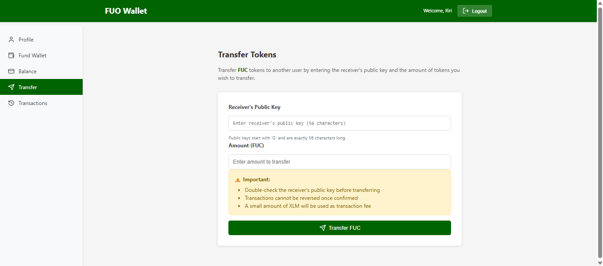

# FUO Wallet - Frontend (Web Application)

This is the web interface for the FUO Wallet System. It gives users an alternative to the mobile app for managing their wallet. It allows users to sign up, fund their wallet via Paystack, check their FUC token balance, transfer tokens to other users and check their transaction history.
It is built with React and Vite.

> **Live Demo:** [fuo-wallet-web.vercel.app](https://fuo-wallet-web.vercel.app/)

---

## Screenshots

| Sign Up                                         | Profile                                         | Transfer                                          |
| ----------------------------------------------- | ----------------------------------------------- | ------------------------------------------------- |
|  |  |  |

---

**Related repositories:**

- Backend (Node.js/Express): [fuo-wallet-backend](https://github.com/adetolaa99/backend-prj)
- Mobile app (React Native): [fuo-wallet-mobile](https://github.com/adetolaa99/mobile-prj)

---

## Tech Stack

| Layer      | Technology |
| ---------- | ---------- |
| Framework  | React      |
| Build Tool | Vite       |
| Styling    | CSS        |

---

## Getting Started

### Prerequisites

- Node.js v18+
- The backend server running locally or deployed

### Installation

```bash
git clone https://github.com/adetolaa99/fuo-wallet-web.git
cd fuo-wallet-web
npm install
```

### Environment Variables

Create a `.env` file in the root directory:

```env
VITE_API_URL=http://localhost:9000
```

For production, set this to your deployed backend URL.

### Running the App

```bash
npm run dev
```

The app will be available at `http://localhost:5173`.

**Build for production:**

```bash
npm run build
```

---

## License

This project is licensed under the [MIT License](LICENSE).

---
